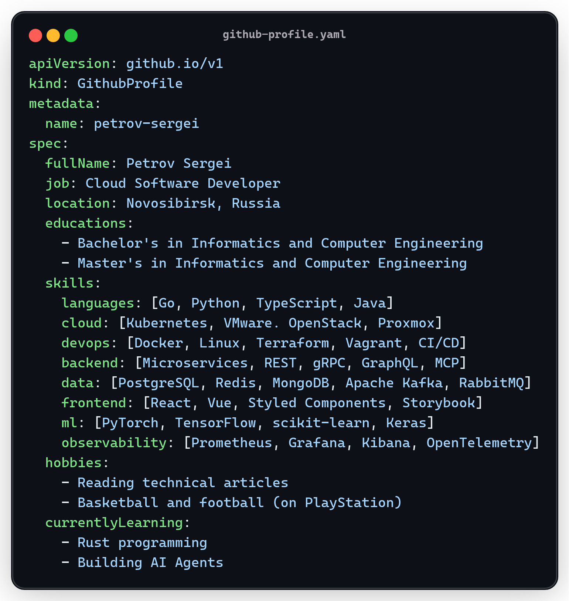

<h1 align="center">
    
</h1>

    

## 👩‍💻 About Me

<!--CODESNAP
output: assets/github-profile.png
type: image
title: github-profile.yaml
background: "#00000000"
codeTheme: github-dark-default
themesFolder: assets/codesnap
code: |
    apiVersion: github.io/v1
    kind: GithubProfile
    metadata:
      name: petrov-sergei
    spec:
      fullName: Petrov Sergei
      job: Cloud Software Developer
      location: Novosibirsk, Russia
      educations:
        - Bachelor's in Informatics and Computer Engineering
        - Master's in Informatics and Computer Engineering
      skills:
        languages: [Go, Python, TypeScript, Java]
        cloud: [Kubernetes, OpenStack, VMware]
        devops: [Docker, Linux, Terraform, Vagrant, CI/CD]
        backend: [Microservices, REST, gRPC, GraphQL, MCP]
        data: [PostgreSQL, Redis, MongoDB, Apache Kafka, RabbitMQ]
        frontend: [React, Vue, Styled Components, Storybook]
        ml: [PyTorch, TensorFlow, scikit-learn, Keras]
        observability: [Prometheus, Grafana, Kibana, OpenTelemetry]
      hobbies:
        - Reading technical articles
        - Basketball and football (on PlayStation)
      currentlyLearning:
        - Rust programming
        - Building AI Agents
-->

    

## 📊 Stats

