<h1 align="center">


</h1>

<div align="center">

[](https://t.me/ptrvsrg)
[](https://linkedin.com/in/ptrvsrg)
[](https://stackoverflow.com/users/20197865)
[](https://habr.com/ru/users/ptrvsrgk)
[](mailto:s.petrov1@g.nsu.ru)

</div>

## :man_technologist: About Me

```rust
apiVersion: "github.io/v1"
kind: "GithubProfile"
metadata:
  name: "petrov-sergei"
spec:
  fullName: "Petrov Sergei"
  job: "Cloud Software Developer"
  location: "Novosibirsk, Russia"
  educations:
    - "Bachelor's in Informatics and Computer Engineering"
    - "Master's in Informatics and Computer Engineering"
  skills:
    languages: ["Go", "Python", "TypeScript", "Java"]
    cloud: ["Kubernetes", "VMware", "OpenStack", "Proxmox"]
    devops: ["Docker", "Linux", "Terraform", "Vagrant", "CI/CD"]
    backend: ["Microservices", "REST", "gRPC", "GraphQL", "MCP"]
    data: ["PostgreSQL", "Redis", "MongoDB", "Apache Kafka", "RabbitMQ"]
    frontend: ["React", "Vue", "Styled Components", "Storybook"]
    ml: ["PyTorch", "TensorFlow", "scikit-learn", "Keras"]
    observability: ["Prometheus", "Grafana", "Kibana", "OpenTelemetry"]
  hobbies:
    - "Reading technical articles"
    - "Basketball and football (on PlayStation)"
  learning:
    - "Rust programming"
    - "Building AI Agents"
```

## :bar_chart: Stats

<p align="center">
  <table>
    <tr>
      <td align="center">
        
      </td>
      <td align="center">
        
      </td>
    </tr>
  </table>
</p>

## :trophy: Achievements

<!--START_SECTION:credly-->
<div align="center">
<a href="https://www.credly.com/org/the-linux-foundation/badge/lfs158-introduction-to-kubernetes"></a>
</div>
<!--END_SECTION:credly-->

<br/>

<!--START_SECTION:achievements-->
<div align="center">


</div>
<!--END_SECTION:achievements-->

## :newspaper: Recent Activity

<!--START_SECTION:activity-->
1. ❌ Labeled PR [#21261](https://github.com/deckhouse/deckhouse/pull/21261) in [deckhouse/deckhouse](https://github.com/deckhouse/deckhouse)
2. ❌ Closed PR [#21268](https://github.com/deckhouse/deckhouse/pull/21268) in [deckhouse/deckhouse](https://github.com/deckhouse/deckhouse)
3. 💪 Opened PR [#21268](https://github.com/deckhouse/deckhouse/pull/21268) in [deckhouse/deckhouse](https://github.com/deckhouse/deckhouse)
4. ❌ Labeled PR [#21261](https://github.com/deckhouse/deckhouse/pull/21261) in [deckhouse/deckhouse](https://github.com/deckhouse/deckhouse)
5. ❌ Assigned PR [#21261](https://github.com/deckhouse/deckhouse/pull/21261) in [deckhouse/deckhouse](https://github.com/deckhouse/deckhouse)
6. 💪 Opened PR [#21261](https://github.com/deckhouse/deckhouse/pull/21261) in [deckhouse/deckhouse](https://github.com/deckhouse/deckhouse)
7. ❌ Labeled PR [#21245](https://github.com/deckhouse/deckhouse/pull/21245) in [deckhouse/deckhouse](https://github.com/deckhouse/deckhouse)
8. 💪 Opened PR [#21245](https://github.com/deckhouse/deckhouse/pull/21245) in [deckhouse/deckhouse](https://github.com/deckhouse/deckhouse)
9. ❌ Assigned PR [#21245](https://github.com/deckhouse/deckhouse/pull/21245) in [deckhouse/deckhouse](https://github.com/deckhouse/deckhouse)
10. 💪 Opened PR [#23](https://github.com/deckhouse/mcm/pull/23) in [deckhouse/mcm](https://github.com/deckhouse/mcm)
<!--END_SECTION:activity-->
