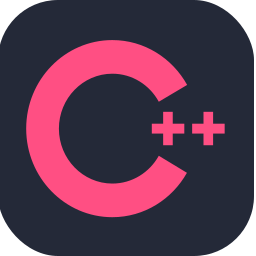
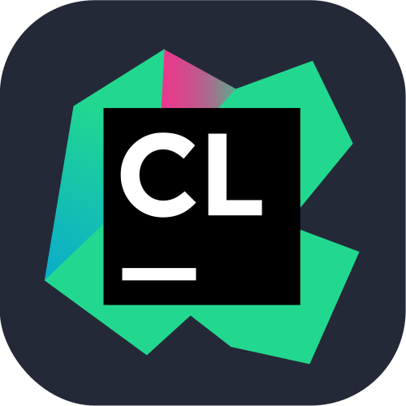
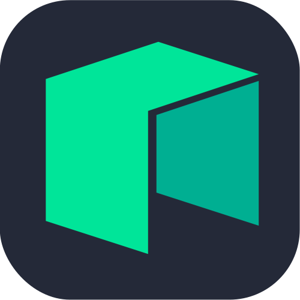
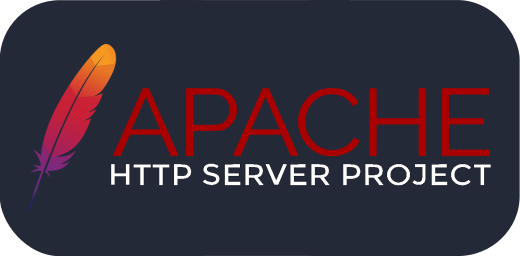

<h1 align="center">
    Hi there, I'm Sergey
    
</h1>

    
    
    
    
    

<h2>GitHub Stats</h2>

<h2>Languages</h2>

<h2>C/C++</h2>

<h2>Java</h2>

<h2>Database</h2>

<h2>DevOps</h2>

<h2>Documentation</h2>

